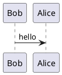

# 日常记录 

  

读书不是让你记住多少知识，是让你更容易识破别人的谎言！

注：vuepress转成静态站点时   暂时只支持[typora_plugin](https://github.com/obgnail/typora_plugin/tree/master)中以下插件渲染

chart

```chart
// ==BlockCodeConfig==
// @align            center
// @width            auto
// @height           300px
// @backgroundColor  transparent
// ==/BlockCodeConfig==

// Built-in variables:
//   1. Chart:   chart Class
//   2. config:  chart option object
//   3. this:    chart plugin instance
// API:  https://chart.nodejs.cn/docs/latest/configuration/
// NOTE: Code within this block will be evaluated. Exercise caution

config = {
  type: "bar",
  data: {
    labels: ["Red", "Blue", "Yellow", "Green", "Purple", "Orange"],
    datasets: [{
      label: "图表",
      data: [12, 19, 3, 5, 2, 3],
      backgroundColor: [
        "rgba(255, 99, 132, 0.2)", "rgba(54, 162, 235, 0.2)", "rgba(255, 206, 86, 0.2)",
        "rgba(75, 192, 192, 0.2)", "rgba(153, 102, 255, 0.2)", "rgba(255, 159, 64, 0.2)"
      ],
      borderColor: [
        "rgba(255, 99, 132, 1)", "rgba(54, 162, 235, 1)", "rgba(255, 206, 86, 1)",
        "rgba(75, 192, 192, 1)", "rgba(153, 102, 255, 1)", "rgba(255, 159, 64, 1)"
      ],
      borderWidth: 1
    }]
  }
}
```

echarts

```echarts
// ==BlockCodeConfig==
// @locale           en
// @theme            light
// @renderer         svg
// @width            auto
// @height           300px
// @backgroundColor  transparent
// ==/BlockCodeConfig==

// Built-in variables:
//   1. myChart: ECharts instance
//   2. echarts: ECharts module
//   3. option:  ECharts option object
//   4. this:    ECharts plugin instance
// Examples: https://echarts.apache.org/examples/en/index.html#chart-type-line
// NOTE:     Code within this block will be evaluated. Exercise caution

option = {
    tooltip: { trigger: 'item' },
    legend: { top: '5%', left: 'center' },
    series: [{
        name: 'Access From',
        type: 'pie',
        radius: ['40%', '70%'],
        avoidLabelOverlap: false,
        label: { show: false, position: 'center' },
        emphasis: { label: { show: true,  fontSize: 40,  fontWeight: 'bold' } },
        labelLine: { show: false },
        data: [
            {value: 1548, name: 'Search Engine'},
            {value: 735, name: 'Direct'},
            {value: 580, name: 'Email'},
            {value: 484, name: 'Union Ads'},
            {value: 310, name: 'Video Ads'},
        ],
    }]
}
```

markmap

```markmap
---
title: markmap
markmap:
  zoom: false
  pan: false
  toggleRecursively: false
  maxWidth: 0
  nodeMinHeight: 16
  spacingHorizontal: 80
  spacingVertical: 5
  paddingX: 8
  fitRatio: 0.95
  initialExpandLevel: -1
  colorFreezeLevel: 7
  maxInitialScale: 2
  color: ["#4E79A7", "#F28E2C", "#E15759", "#76B7B2", "#59A14F", "#EDC949", "#AF7AA1", "#FF9DA7", "#9C755F", "#BAB0AB"]
  duration: 500
  height: 300px
  backgroundColor: "#F8F8F8"
---

## Links

- [Website](https://markmap.js.org/)
- [GitHub](https://github.com/gera2ld/markmap)

## Features

Note that if blocks and lists appear at the same level, the lists will be ignored

### Lists

- **strong** ~~del~~ *italic* ==highlight==
- `inline code`
- [x] checkbox
- Katex: $x = {-b \pm \sqrt{b^2-4ac} \over 2a}$ <!-- markmap: fold -->
  - [More Katex Examples](#?d=gist:af76a4c245b302206b16aec503dbe07b:katex.md)
- Now we can wrap very very very very long text based on `maxWidth` option

### Blocks

| Products | Price |
|-|-|
| Apple | 4 |
| Banana | 2 |
```

plantuml



callouts

> [!tip]
> Support Type: TIP、BUG、INFO、NOTE、QUOTE、EXAMPLE、CAUTION、FAILURE、WARNING、SUCCESS、QUESTION、ABSTRACT、IMPORTANT

> [!bug]
> Support Type: TIP、BUG、INFO、NOTE、QUOTE、EXAMPLE、CAUTION、FAILURE、WARNING、SUCCESS、QUESTION、ABSTRACT、IMPORTANT

> [!info]
> Support Type: TIP、BUG、INFO、NOTE、QUOTE、EXAMPLE、CAUTION、FAILURE、WARNING、SUCCESS、QUESTION、ABSTRACT、IMPORTANT

> [!note]
> Support Type: TIP、BUG、INFO、NOTE、QUOTE、EXAMPLE、CAUTION、FAILURE、WARNING、SUCCESS、QUESTION、ABSTRACT、IMPORTANT

> [!quote]
> Support Type: TIP、BUG、INFO、NOTE、QUOTE、EXAMPLE、CAUTION、FAILURE、WARNING、SUCCESS、QUESTION、ABSTRACT、IMPORTANT

> [!example]
> Support Type: TIP、BUG、INFO、NOTE、QUOTE、EXAMPLE、CAUTION、FAILURE、WARNING、SUCCESS、QUESTION、ABSTRACT、IMPORTANT

> [!caution]
> Support Type: TIP、BUG、INFO、NOTE、QUOTE、EXAMPLE、CAUTION、FAILURE、WARNING、SUCCESS、QUESTION、ABSTRACT、IMPORTANT

> [!failure]
> Support Type: TIP、BUG、INFO、NOTE、QUOTE、EXAMPLE、CAUTION、FAILURE、WARNING、SUCCESS、QUESTION、ABSTRACT、IMPORTANT

> [!warning]
> Support Type: TIP、BUG、INFO、NOTE、QUOTE、EXAMPLE、CAUTION、FAILURE、WARNING、SUCCESS、QUESTION、ABSTRACT、IMPORTANT

> [!success]
> Support Type: TIP、BUG、INFO、NOTE、QUOTE、EXAMPLE、CAUTION、FAILURE、WARNING、SUCCESS、QUESTION、ABSTRACT、IMPORTANT

> [!question]
> Support Type: TIP、BUG、INFO、NOTE、QUOTE、EXAMPLE、CAUTION、FAILURE、WARNING、SUCCESS、QUESTION、ABSTRACT、IMPORTANT

> [!abstract]
> Support Type: TIP、BUG、INFO、NOTE、QUOTE、EXAMPLE、CAUTION、FAILURE、WARNING、SUCCESS、QUESTION、ABSTRACT、IMPORTANT

> [!important]
> Support Type: TIP、BUG、INFO、NOTE、QUOTE、EXAMPLE、CAUTION、FAILURE、WARNING、SUCCESS、QUESTION、ABSTRACT、IMPORTANT

> Support Type: TIP、BUG、INFO、NOTE、QUOTE、EXAMPLE、CAUTION、FAILURE、WARNING、SUCCESS、QUESTION、ABSTRACT、IMPORTANT

