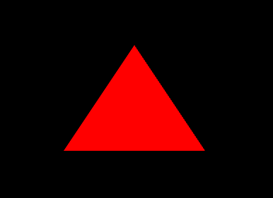
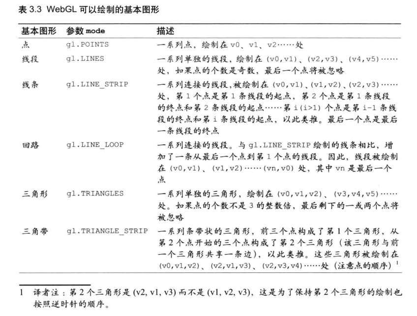
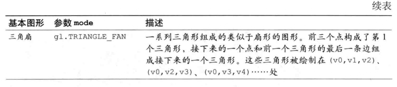
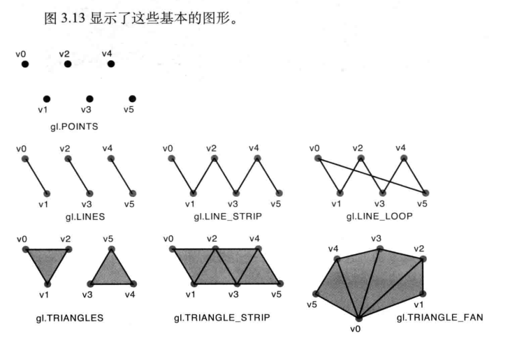

# 6/helloTriangle 绘三角形



> [!info]
> 和一次绘多个点类似

```
/**
 * Create a program object and make current
 * @param gl GL context
 * @param vshader a vertex shader program (string)
 * @param fshader a fragment shader program (string)
 * @return true, if the program object was created and successfully made current 
 */
function initShaders(gl, vshader, fshader) {
  var program = createProgram(gl, vshader, fshader);
  if (!program) {
    console.log('Failed to create program');
    return false;
  }

  gl.useProgram(program);
  gl.program = program;

  return true;
}

/**
 * Create the linked program object
 * @param gl GL context
 * @param vshader a vertex shader program (string)
 * @param fshader a fragment shader program (string)
 * @return created program object, or null if the creation has failed
 */
function createProgram(gl, vshader, fshader) {
  // Create shader object
  var vertexShader = loadShader(gl, gl.VERTEX_SHADER, vshader);
  var fragmentShader = loadShader(gl, gl.FRAGMENT_SHADER, fshader);
  if (!vertexShader || !fragmentShader) {
    return null;
  }

  // Create a program object
  var program = gl.createProgram();
  if (!program) {
    return null;
  }

  // Attach the shader objects
  gl.attachShader(program, vertexShader);
  gl.attachShader(program, fragmentShader);

  // Link the program object
  gl.linkProgram(program);

  // Check the result of linking
  var linked = gl.getProgramParameter(program, gl.LINK_STATUS);
  if (!linked) {
    var error = gl.getProgramInfoLog(program);
    console.log('Failed to link program: ' + error);
    gl.deleteProgram(program);
    gl.deleteShader(fragmentShader);
    gl.deleteShader(vertexShader);
    return null;
  }
  return program;
}

/**
 * Create a shader object
 * @param gl GL context
 * @param type the type of the shader object to be created
 * @param source shader program (string)
 * @return created shader object, or null if the creation has failed.
 */
function loadShader(gl, type, source) {
  // Create shader object
  var shader = gl.createShader(type);
  if (shader == null) {
    console.log('unable to create shader');
    return null;
  }

  // Set the shader program
  gl.shaderSource(shader, source);

  // Compile the shader
  gl.compileShader(shader);

  // Check the result of compilation
  var compiled = gl.getShaderParameter(shader, gl.COMPILE_STATUS);
  if (!compiled) {
    var error = gl.getShaderInfoLog(shader);
    console.log('Failed to compile shader: ' + error);
    gl.deleteShader(shader);
    return null;
  }

  return shader;
}

function initWebGL(canvas) {
  const dpr = window.devicePixelRatio || 1;
  console.log(dpr);
  canvas.width = 400 * dpr;
  canvas.height = 300 * dpr;
  canvas.style.width = '400px';
  canvas.style.height = '300px'

  const gl = canvas.getContext('webgl');
  if (!gl) {
    console.error('Failed to get WebGL context');
    return null;
  }
  gl.viewport(0, 0, canvas.width, canvas.height);
  gl.clearColor(0, 0, 0, 1);
  return gl;
}


window.onload = function(){

    /*
        着色器是申明attribute变量
        attribute变量赋值给gl_Position
        向attribute变量传递变量
     */
    //顶点着色器程序
    var VSHADER_SOURCE = 
    'attribute vec4 a_Position;\n'+ 
    'void main(){\n'+
    ' gl_Position = a_Position;\n'+
    '}\n';

    // //片元着色器
    var FSHADER_SOURCE =  
    'void main(){\n'+
    ' gl_FragColor = vec4(1.0, 0.0, 0.0, 1.0);\n'+
    '}\n';
 

    var canvas = document.getElementById('webgl')
    var gl = initWebGL(canvas)
    if(!gl){
        console.log('Failed to get thd rendering context for webgl')
        return;
    }

    //初始着色器
    if(!initShaders(gl,VSHADER_SOURCE,FSHADER_SOURCE)){
        console.log('failed to initialize shaders')
        return;
    }

    //设置顶点位置
    var n = initVertexBuffers(gl)
    if(n<0){
        console.log('failed to set the position of the vertices')
        return;
    }
     //设置<canvas>背景色
    gl.clearColor(0.0,0.0,0.0,1.0);

    // //清空<canvas>
    gl.clear(gl.COLOR_BUFFER_BIT)

    // //绘制三角形
    gl.drawArrays(gl.TRIANGLES,0,n)
     //gl.drawArrays(gl.LINES,0,n)
    // gl.drawArrays(gl.LINE_STRIP,0,n)
    //gl.drawArrays(gl.LINE_LOOP,0,n)


    /*
    使用缓冲区对象向顶点着色器传入多个顶点的数据 五步骤
    1.创建缓冲区对象 (gl.createBuffer())。
    2.绑定缓冲区对象(gl.bindBuffer())。
    3.将数据写人缓冲区对象(gl.bufferData())。
    4.将缓冲区对象分配给一个attribute变量(gl.vertexAttribPointer())
    5.开启attribute变量(gl.enableVertexAttribArray())。*/
    function initVertexBuffers(gl){
        var vertices = new Float32Array([
            0.0,0.5,-0.5,-0.5,0.5,-0.5
        ]) 
        var n = 3;

        //1创建缓存区对象
        var vertexBuffer = gl.createBuffer();
        if(!vertexBuffer){
            console.log('failed to create the buffer object');
            return -1;
        }

        //2将缓存区对象绑定到目标。这个“目标”表示缓冲区对象的用途（在这里，就是向顶点着色器提供传给attribute变量的数据)，这样WebGL才能够正确处理其中的内容。
        //gl.ARRAY_BUFFER表示缓冲区对象中包含了顶点的索引值 
        gl.bindBuffer(gl.ARRAY_BUFFER,vertexBuffer)

        //3向缓存区对象中写入数据
        //该方法的效果是，将第2个参数vertices中的数据写入了绑定到第1个参数gl.ARRAY_BUFFER上的缓冲区对象。
        //我们不能直接向缓冲区写入数据，而只能向“目标"写人数据，所以要向缓冲区写数据，必须先绑定。 
        gl.bufferData(gl.ARRAY_BUFFER,vertices,gl.STATIC_DRAW);

        var a_Position = gl.getAttribLocation(gl.program,'a_Position');
        if(a_Position < 0){
            console.log('failed to get the storage location of a_Position')
        }  

        //4、分配 将缓存区对象分配给a_Position变量
        gl.vertexAttribPointer(a_Position,2,gl.FLOAT,false,0,0);

        //5、连接 连接a_Position变量与分配给它的缓存区对象
        gl.enableVertexAttribArray(a_Position);

        return n;

    } 

}
```

> [!note]
> gl.drawArrays(gl.TRIANGLES, 0, n);
>
> 

